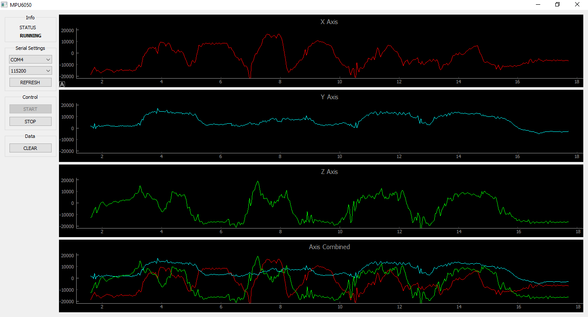

# MPU6050 Visualizer Using PyQt5

### Install
```
pip install -r requirements.txt
main.py
 ```
### Todo
  1. An realtime 3d object antimation based on the gyro values.
  2. Using EKF algorithm to make the system more efficient and optimized.
  
### Preview

